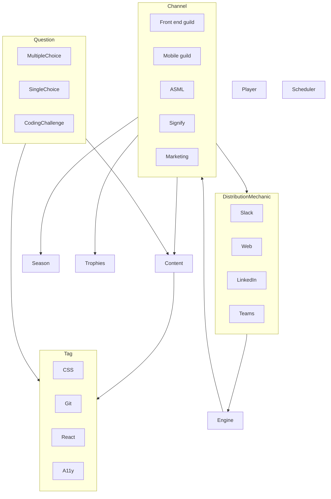

### Architecture

### Apps

UI - Responsible for building the UI components. Storybook is used to develop and test UI components in isolation.
frontend - Responsible for building the frontend application with Remix and React.
api - Responsible for building the API with Node.js and Express. This agnostic package should provide endpoints the frontend can use to fetch data.
server-auth - Responsible for connecting with firebase-admin to get data from firebase. This package should be used by the api package to get data from firebase.
client-auth - Responsible for providing GoogleAuth login.
