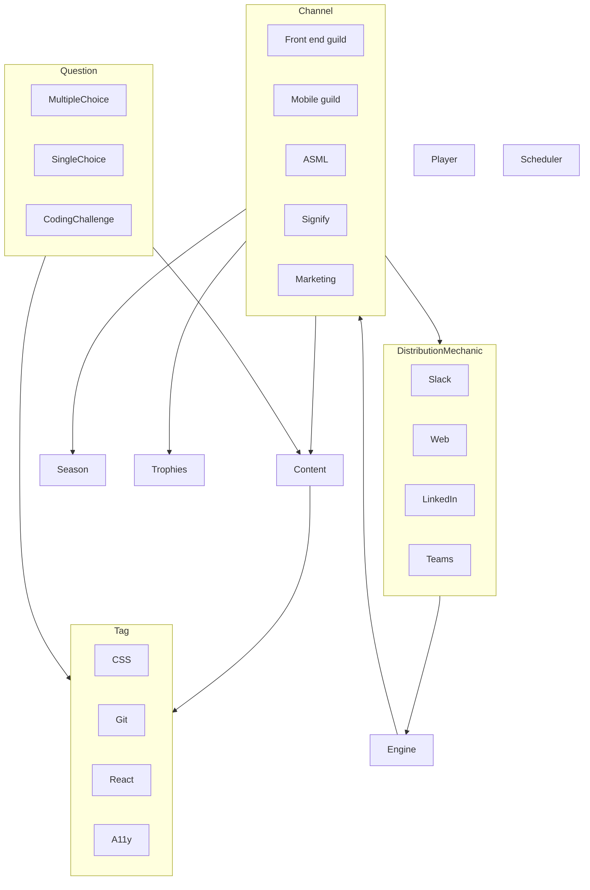

### Development environment

Setup the app:

- Gain all `.env` files
- Gain the firebase service account key
- `yarn install` in the root
- `yarn build-libs` in the root
- Run the app in the root: `yarn start`

To run the app connected to the local firestore, run the following:

- In the API packages, uncomment 'FIRESTORE_EMULATOR_HOST="localhost:8080"' in the .env file
- For now, uncomment checkIfAuthenticated function for each request you're working with
- Run the firestore command found in the package.json of the server-auth package to startup an empty or seeded firestore
- In the root, run `yarn start` to concurrently start the api and remix frontend

### Learning goals

- Improve skills on how to use Remix / Firebase / React / Typescript (Full-stack)
- Learn how to manage a bigger project which is live and used by people
- Allow room for my own "creative nostalgia" with gamification applications
- Create a project that is fun to work on and can be used by others

### Architecture

### Apps

- **UI** - Responsible for building the UI components. Storybook is used to develop and test UI components in isolation.
- **frontend** - Responsible for building the frontend application with Remix and React.
- **api** - Responsible for building the API with Node.js and Express. This agnostic package should provide endpoints the frontend can use to fetch data.
- **server-auth** - Responsible for connecting with firebase-admin to get data from firebase. This package should be used by the api package to get data from firebase.
- **client-auth** - Responsible for providing GoogleAuth login.

### Architecture Decision Records (ADR)

An architecture decision record (ADR) is a document that captures an important architecture decision made along with its context and consequences.

Our team documents architecture decisions in the `architecture-decision-records` directory of this repo.

For more info on the ADR's, examples and templates, see [here](https://github.com/joelparkerhenderson/architecture-decision-record/blob/main/README.md)
