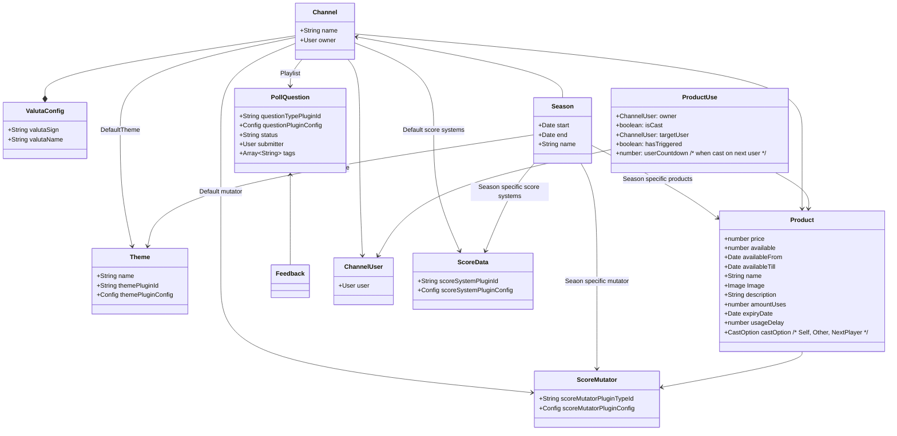

# Technical design

## Data Model

```mermaid
classDiagram
    class Channel {
        +String name
        +User owner
    }
    Channel --* ValutaConfig
    Channel --> Theme : DefaultTheme

    class ValutaConfig {
        +String valutaSign
        +String valutaName
    }

    class Season {
        +Date start
        +Date end
        +String name
    }

    Channel <-- Season
    Season --> Theme : Season specific theme
    Season --> Product : Season specific products
    Channel --> ScoreMutator : Default mutator
    Season --> ScoreMutator : Seaon specific mutator

    class PollQuestion {
        +String questionTypePluginId
        +Config questionPluginConfig
        +String status
        +User submitter
        +Array~String~ tags
    }

    PollQuestion <-- Feedback
    Channel --> PollQuestion : Playlist

    Channel --> Product

    class ChannelUser {
        +User user
    }
    Channel --> ChannelUser

    class Product {
        +number price
        +number available
        +Date availableFrom
        +Date availableTill
        +String name
        +Image Image
        +String description
        +number amountUses
        +Date expiryDate
        +number usageDelay
        +CastOption castOption /* Self, Other, NextPlayer */
    }

    Product --> ScoreMutator

    class ScoreMutator {
        +String scoreMutatorPluginTypeId
        +Config scoreMutatorPluginConfig
    }

    class ProductUse {
        +ChannelUser: owner
        +boolean: isCast
        +ChannelUser: targetUser
        +boolean: hasTriggered
        +number: userCountdown /* when cast on next user */
    }

    class Theme {
        +String name
        +String themePluginId
        +Config themePluginConfig
    }
    ProductUse --> ChannelUser
    ProductUse --> Product

    Channel --> ScoreData : Default score systems
    Season --> ScoreData : Season specific score systems

    class ScoreData {
        +String scoreSystemPluginId
        +Config scoreSystemPluginConfig
    }

```
