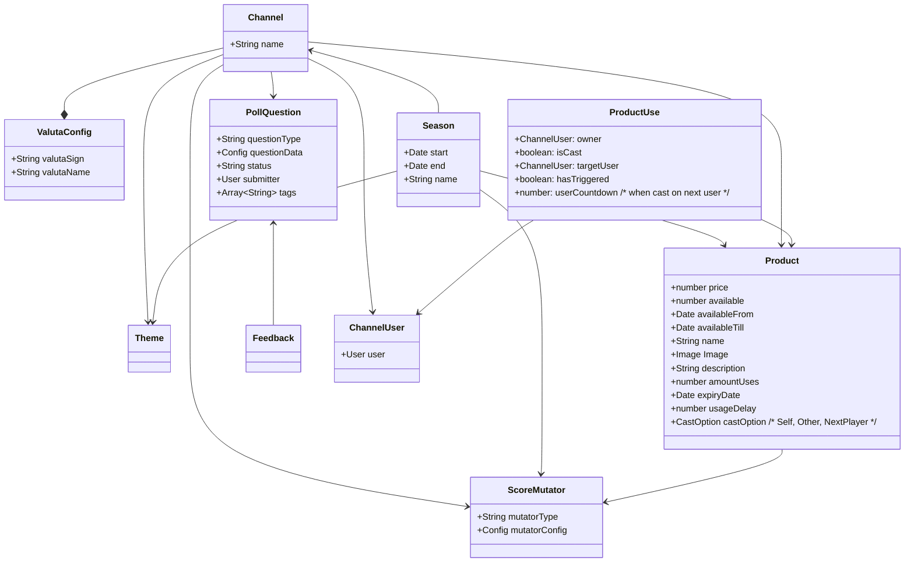

# Technical design

## Data Model

```mermaid
classDiagram
    class Channel{
        +String name
    }
    Channel --* ValutaConfig
    Channel --> Theme

    class ValutaConfig {
        +String valutaSign
        +String valutaName
    }

    class Theme

    class Season {
        +Date start
        +Date end
        +String name
    }

    Channel <-- Season
    Season --> Theme
    Season --> Product
    Channel --> ScoreMutator
    Season --> ScoreMutator

    class PollQuestion {
        +String questionType
        +Config questionData
        +String status
        +User submitter
        +Array~String~ tags
    }

    PollQuestion <-- Feedback
    Channel --> PollQuestion

    Channel --> Product

    class ChannelUser {
        +User user
    }
    Channel --> ChannelUser

    class Product {
        +number price
        +number available
        +Date availableFrom
        +Date availableTill
        +String name
        +Image Image
        +String description
        +number amountUses
        +Date expiryDate
        +number usageDelay
        +CastOption castOption /* Self, Other, NextPlayer */
    }

    Product --> ScoreMutator

    class ScoreMutator{
        +String mutatorType
        +Config mutatorConfig
    }

    class ProductUse {
        +ChannelUser: owner
        +boolean: isCast
        +ChannelUser: targetUser
        +boolean: hasTriggered
        +number: userCountdown /* when cast on next user */

    }
    ProductUse --> ChannelUser

    ProductUse --> Product

```
